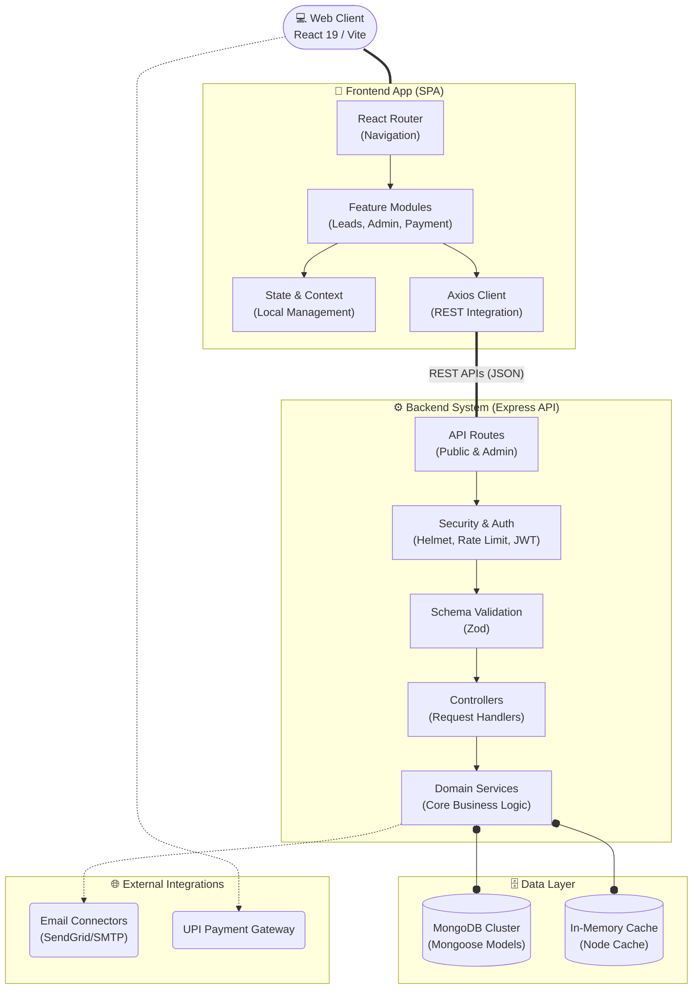

<h1 align="center">SOP Writer</h1>

<p align="center">
  <strong>A modern, full-stack platform for professional Statement of Purpose (SOP) writing services.</strong>
</p>

<p align="center">
  
</p>

## Overview

SOP Writer is a production-ready web application designed to manage the entire lifecycle of professional writing services. Built to handle customer inquiries, process secure UPI payments, and provide administrators with a comprehensive dashboard, the platform streamlines lead tracking and order fulfillment. It prioritizes performance, security, and developer experience through modern tooling and a robust architectural design.

## Tech Stack

**Frontend**
- **Framework:** React 19.2, Vite
- **Styling & UI:** Tailwind CSS 4, Radix UI, Framer Motion
- **Language:** TypeScript 5.9
- **Routing & State:** React Router 7.x

**Backend**
- **Runtime & Framework:** Node.js (≥20.19.0), Express.js 5.x
- **Language:** TypeScript 5.9
- **Validation & Auth:** Zod schema validation, JWT Authentication, bcrypt
- **Security:** Helmet.js, configured CORS, Rate Limiting

**Database & Tools**
- **Database:** MongoDB with Mongoose 9.x
- **Testing:** Jest (Backend), Vitest (Frontend)
- **Logging:** Pino

**Deployment & DevOps**
- **Containerization:** Docker & Docker Compose
- **Tooling:** ESLint, Prettier

## Key Features

- **Lead Management System:** Capture and track customer inquiries through a smooth frontend multi-step wizard.
- **Secure Payment Integration:** Seamless UPI-based payment processing with automated QR code generation and transaction verification.
- **Admin Dashboard:** Protected portal for comprehensive lead management, analytics, and transaction tracking.
- **Automated Communication:** Event-driven email automation (SendGrid/SMTP) for customer notifications and admin alerts.
- **Robust Security:** Built-in defenses against DDoS and abuse with IP rate limiting, secure HTTP headers, runtime validation, and stateless authentication.
- **Dynamic Configuration:** Real-time, centralized settings for services, pricing, and system variables updateable without redeployments.

## Architecture

The system follows a fundamentally decoupled client-server architecture:



- **Client App (SPA):** A React-based Single Page Application focused on fast UX, accessible UI primitives, and animated transitions. Communicates securely with the API over REST.
- **RESTful API:** An Express server acting as the central nervous system. It handles business logic, securely connects to the MongoDB cluster, and integrates with external services (e.g., mail providers).
- **Data Layer:** MongoDB provides a flexible schema for leads, transactions, and global platform settings, managed via Mongoose models with strict schema definitions.

## How It Works

The development approach emphasizes type safety, runtime validation, and highly cohesive modularity: 
- **Type Safety Pipeline:** TypeScript is used pervasively across both frontend and backend to ensure compile-time safety. Contracts between the client and server are heavily reinforced using Zod schemas to validate runtime data at the network boundary.
- **Separation of Concerns:** The backend isolates concerns into routers, controllers, and services. This decouples business logic from HTTP transport layers, making unit and integration testing highly effective (current backend coverage >70%).
- **State & Routing:** The frontend utilizes modular context providers and React Router for efficient client-side declarative routing. State management is kept close to where it's needed rather than relying on bloated global stores.

## Project Structure

```text
SOPWriter/
├── sopwriter-backend/          # Express.js REST API
│   ├── src/
│   │   ├── config/             # System configuration (Env, DB, Logger)
│   │   ├── controllers/        # Request handlers
│   │   ├── middlewares/        # Auth, Rate Limiting, Error validation
│   │   ├── models/             # Mongoose schemas
│   │   ├── routes/             # API routing
│   │   ├── services/           # Core business logic
│   │   └── tests/              # Extensive Unit & Integration testing
│   └── docker-compose.yml      # Local development container config
│
└── sopwriter-frontend/         # Vite + React Application
    ├── src/
    │   ├── app/                # Shell, routing, and global providers
    │   ├── components/         # Reusable UI components
    │   ├── core/               # App configuration and API client
    │   ├── features/           # Domain-driven modules (Admin, Leads, Payment)
    │   └── shared/             # Shared hooks and utilities
    └── package.json            # Frontend dependency management
```

## Installation

Ensure you have **Node.js (≥ 20.19.0)** and **MongoDB** installed on your system.

1. **Clone the repository:**
   ```bash
   git clone https://github.com/pulkitagg17/SOPWriter.git
   cd SOPWriter
   ```

2. **Backend Setup:**
   ```bash
   cd sopwriter-backend
   npm install
   cp .env.example .env     # Configure your variables (see below)
   npm run dev              # Starts the API server on http://localhost:5000
   ```

3. **Frontend Setup:**
   ```bash
   cd ../sopwriter-frontend
   npm install
   npm run dev              # Starts the development server on http://localhost:5173
   ```

*(Alternatively, run `npm run docker:dev` inside the backend directory to provision the backend and datastore using Docker Compose.)*

## Usage

- **Client Application:** Navigate to `http://localhost:5173`. Click "Get Started" to initiate the service selection wizard, provide contact details, and seamlessly proceed to the UPI payment gateway.
- **Admin Dashboard:** Go to `http://localhost:5173/admin/login` (or the equivalent configured route). Log in using the provisioned admin credentials to manage incoming leads, authorize transactions, and configure platform settings.
- **Testing:** Inside the `sopwriter-backend` directory, run `npm test` to execute the full suite of Jest unit and integration tests. Run `npm run test:coverage` for generating a structural coverage report.

## Environment Variables

Configure the `.env` file in your `sopwriter-backend` directory:

```env
PORT=5000
NODE_ENV=development
MONGO_URI=mongodb://localhost:27017/sopwriter

# Authentication & Security
JWT_SECRET=your_secure_jwt_secret_should_be_long
CORS_ORIGIN=http://localhost:5173

# Email Deliverability
MAIL_PROVIDER=smtp
SMTP_HOST=smtp.gmail.com
SMTP_PORT=587
SMTP_USER=admin@example.com
SMTP_PASS=your_app_password

# Root Admin Bootstrap
ADMIN_EMAIL=admin@sopwriter.com
ADMIN_PASSWORD=your_secure_password
```

## Future Improvements

- Generate structured PDFs continuously for automated draft document delivery.
- Adopt real-time WebSocket communication for instant administrative alerts.
- Abstract the core module to compile a standalone React Native application.
- Expand data analytics visualization panels inside the admin dashboard.

## Author / Credits

**Yash Garg** and **Pulkit Aggarwal**
GitHub: [@yashcu](https://github.com/yashcu) • [@pulkitagg17](https://github.com/pulkitagg17)
